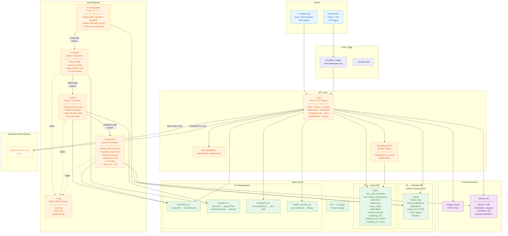
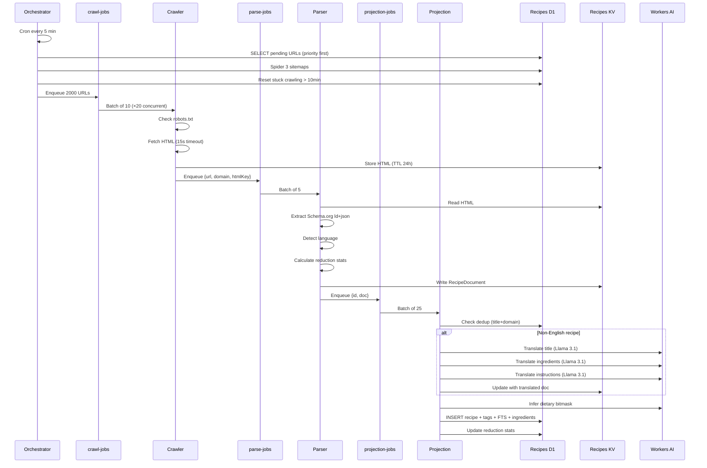
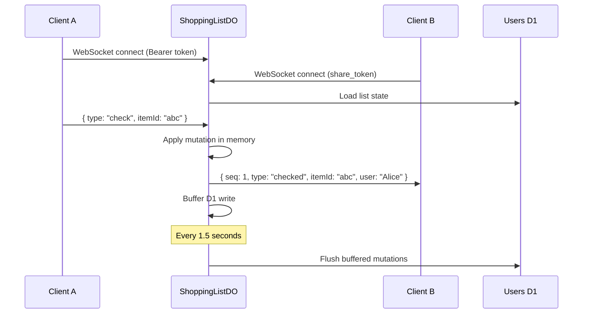

# ReducedRecipes — Architecture Diagram



## Data Flow Summary

### Recipe Ingestion


### Auth Flow
```mermaid
sequenceDiagram
    participant U as User
    participant FE as Frontend
    participant API as rr-api
    participant G as Google OAuth
    participant KV as Session KV
    participant D1 as Users D1

    U->>FE: Click "Sign in"
    FE->>API: GET /auth/google/url?platform=web
    API->>API: Generate PKCE code_verifier
    API->>KV: Store code_verifier (keyed by state)
    API-->>FE: { url: "accounts.google.com/..." }
    FE->>G: Redirect to Google
    G-->>FE: Redirect with ?code=...&state=...
    FE->>API: GET /auth/google/callback?code=...&state=...
    API->>KV: Retrieve code_verifier
    API->>G: Exchange code for tokens (with PKCE)
    G-->>API: { id_token, access_token }
    API->>API: Decode JWT, extract user info
    API->>D1: Upsert user + auth provider
    API->>D1: Create default "Saved" collection
    API->>KV: Create session token
    API-->>FE: Set-Cookie: session={token}; HttpOnly; Secure
```

### Shopping List Real-Time

