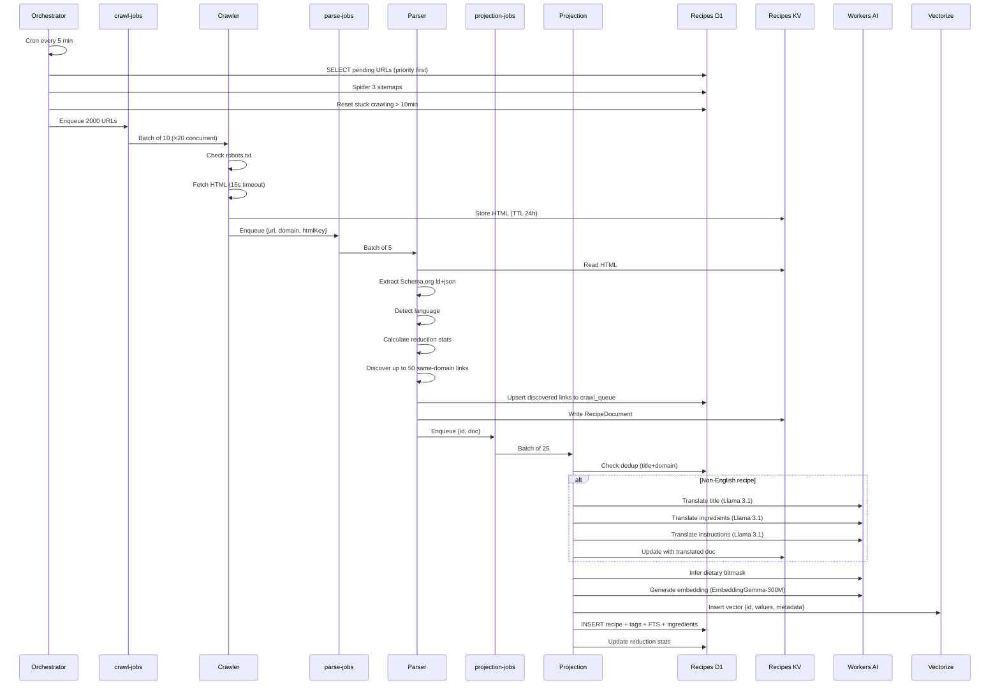
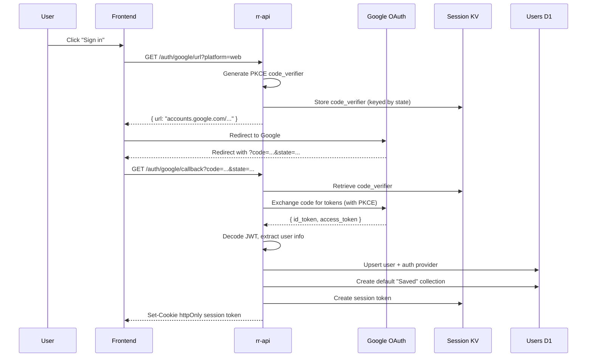
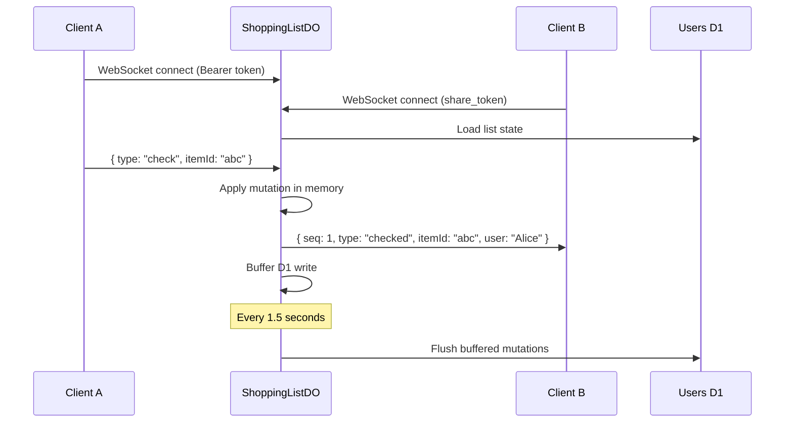
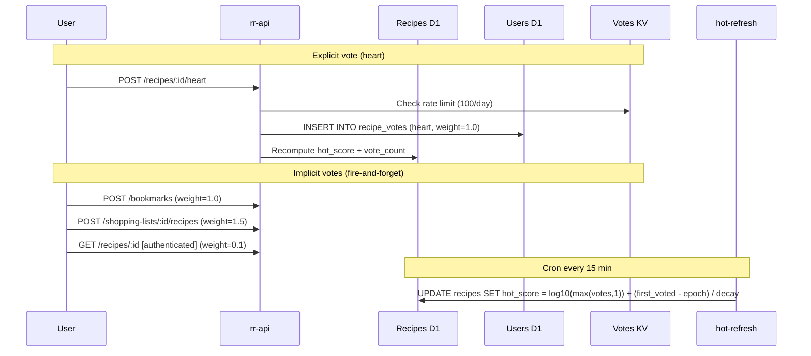
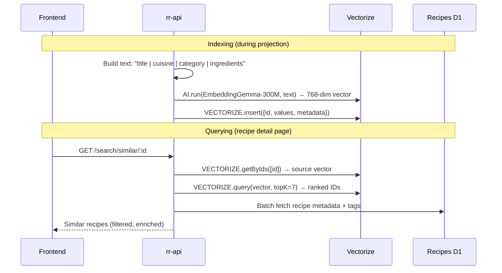

# ReducedRecipes — Architecture Diagram

```mermaid
graph TB
    subgraph "Clients"
        WEB["🌐 Web SPA<br/>React + Vite<br/>CF Pages"]
        MOB["📱 Mobile App<br/>Expo / React Native<br/>EAS Builds"]
    end

    subgraph "CDN / Edge"
        PAGES["Cloudflare Pages<br/>reducedrecipes.com"]
        WORKERS_DEV["*.workers.dev"]
    end

    WEB --> PAGES
    MOB --> API

    subgraph "API Layer"
        API["rr-api<br/>Hono HTTP Server<br/>─────────────<br/>Auth · Recipes · Search<br/>Bookmarks · Collections<br/>Shopping Lists · Sync<br/>Notifications · Dietary<br/>Hearts · Hot Ranking<br/>Funding · Similar Recipes"]
        AUTH_MW["Auth Middleware<br/>requireAuth / optionalAuth"]
        DO["ShoppingListDO<br/>Durable Object<br/>─────────────<br/>WebSocket real-time<br/>collaboration"]
    end

    PAGES --> API
    API --> AUTH_MW
    API --> DO

    subgraph "External Services"
        GOOGLE["Google OAuth<br/>PKCE Flow"]
        KOFI["Ko-Fi Webhook<br/>Donations"]
        WORKERS_AI["Workers AI<br/>─────────────<br/>Llama 3.1 8B<br/>(translation, dietary,<br/>ingredient expansion)<br/>m2m100-1.2B<br/>(cheap translation)<br/>EmbeddingGemma-300M<br/>(vector embeddings)"]
        CF_ANALYTICS["CF GraphQL API<br/>Usage Metrics"]
    end

    API --> GOOGLE
    API --> WORKERS_AI
    API --> KOFI
    BILLING --> CF_ANALYTICS

    subgraph "Crawl Pipeline"
        direction LR
        ORCH["rr-orchestrator<br/>Cron: */5 * * * *<br/>─────────────<br/>• Select URLs (priority + random)<br/>• Spider sitemaps (3/run)<br/>• Reset stuck crawling"]
        CRAWLER["rr-crawler<br/>Queue Consumer<br/>─────────────<br/>• Fetch HTML<br/>• robots.txt check<br/>• Store HTML in KV<br/>• 20 concurrent"]
        PARSER["rr-parser<br/>Queue Consumer<br/>─────────────<br/>• Extract Schema.org<br/>• Detect language<br/>• Calc reduction stats<br/>• Discover links"]
        PROJ["rr-projection<br/>Queue Consumer<br/>─────────────<br/>• Dedup (title+domain)<br/>• Translate (Llama 3.1)<br/>• Dietary inference<br/>• Vector embeddings<br/>• Ingredient index<br/>• FTS index<br/>• Write D1 + KV"]
        DLQ["rr-dlq<br/>Dead Letter Handler<br/>─────────────<br/>crawl-dlq<br/>parse-dlq<br/>projection-dlq"]
    end

    ORCH -->|"crawl-jobs<br/>queue"| CRAWLER
    CRAWLER -->|"parse-jobs<br/>queue"| PARSER
    PARSER -->|"projection-jobs<br/>queue"| PROJ
    CRAWLER -.->|"failed"| DLQ
    PARSER -.->|"failed"| DLQ
    PROJ -.->|"failed"| DLQ

    subgraph "Scheduled Workers"
        HOT_REFRESH["rr-hot-refresh<br/>Cron: */15 * * * *<br/>─────────────<br/>Recompute hot_score<br/>Reddit-style time-decay"]
        BILLING["rr-billing-cron<br/>Cron: daily 06:00 UTC<br/>─────────────<br/>Query CF Analytics API<br/>Compute infra costs<br/>Upsert to FUNDING_DB"]
    end

    HOT_REFRESH --> RECIPES_DB
    BILLING --> FUNDING_DB

    subgraph "Data Stores"
        subgraph "D1 — Recipes DB<br/>reduced-recipes-prod"
            RECIPES_DB["recipes (+ hot_score, vote_count)<br/>recipe_tags<br/>recipe_ingredients<br/>ingredients<br/>recipes_fts (FTS5)<br/>crawl_queue<br/>domains"]
        end

        subgraph "D1 — Users DB<br/>reduced-recipes-users"
            USERS_DB["users · user_auth_providers<br/>user_dietary_preferences<br/>collections · bookmarks<br/>recipe_views · recipe_votes<br/>notifications · consent_records<br/>follows · shopping_lists<br/>shopping_list_items<br/>shopping_list_members"]
        end

        subgraph "D1 — Funding DB<br/>reduced-recipes-funding"
            FUNDING_DB["donations (Ko-Fi)<br/>monthly_costs"]
        end

        subgraph "KV Namespaces"
            RECIPES_KV["RECIPES_KV<br/>recipe:{id} → full JSON doc"]
            CACHE_KV["CACHE_KV<br/>html:{url} → page HTML<br/>cache:health → stats"]
            SESSION_KV["SESSION_KV<br/>session:{token} → user data"]
            USER_CACHE["USER_CACHE_KV<br/>user-prefs:{id} → dietary"]
            VOTES_KV["VOTES_KV<br/>heart-rate:{userId}:{date}<br/>→ daily rate limit"]
        end

        VECTORIZE["Vectorize Index<br/>rr-recipes<br/>─────────────<br/>768-dim embeddings<br/>EmbeddingGemma-300M<br/>Semantic recipe similarity"]

        R2["R2 — rr-images<br/>Recipe images"]
    end

    API --> RECIPES_DB
    API --> USERS_DB
    API --> RECIPES_KV
    API --> SESSION_KV
    API --> USER_CACHE
    API --> VOTES_KV
    API --> VECTORIZE
    DO --> USERS_DB

    ORCH --> RECIPES_DB
    CRAWLER --> CACHE_KV
    PARSER --> RECIPES_KV
    PARSER --> CACHE_KV
    PROJ --> RECIPES_DB
    PROJ --> RECIPES_KV
    PROJ --> WORKERS_AI
    PROJ --> VECTORIZE

    subgraph "Ingredient Parse Queue"
        IPQ["ingredient-parse-jobs<br/>queue"]
    end
    API -->|"add recipe to list"| IPQ
    IPQ -->|"consumer in rr-api"| API

    classDef client fill:#E8F4FD,stroke:#2196F3,color:#1565C0
    classDef worker fill:#FFF3E0,stroke:#FF9800,color:#E65100
    classDef store fill:#E8F5E9,stroke:#4CAF50,color:#2E7D32
    classDef external fill:#F3E5F5,stroke:#9C27B0,color:#6A1B9A
    classDef queue fill:#FFFDE7,stroke:#FFC107,color:#F57F17
    classDef vector fill:#E0F2F1,stroke:#009688,color:#004D40

    class WEB,MOB client
    class API,ORCH,CRAWLER,PARSER,PROJ,DLQ,DO,AUTH_MW,HOT_REFRESH,BILLING worker
    class RECIPES_DB,USERS_DB,FUNDING_DB,RECIPES_KV,CACHE_KV,SESSION_KV,USER_CACHE,VOTES_KV,R2 store
    class GOOGLE,WORKERS_AI,KOFI,CF_ANALYTICS external
    class IPQ queue
    class VECTORIZE vector
```

## Data Flow Summary

### Recipe Ingestion

### Auth Flow

### Shopping List Real-Time

### Hot Ranking & Engagement

### Vector Similarity Search

---

## System Components Summary

| Component | Type | Count | Purpose |
|-----------|------|-------|---------|
| **Workers** | HTTP / Queue / Cron | 8 | API, crawl pipeline (4), DLQ, hot refresh, billing |
| **D1 Databases** | SQLite at edge | 3 | Recipes (7 tables), Users (14 tables), Funding (2 tables) |
| **KV Namespaces** | Key-value | 5 | Recipes, cache, sessions, user prefs, vote rate limits |
| **Queues** | Pub/sub | 7 + 3 DLQ | crawl, parse, projection, ingredient-parse + 3 dead letter |
| **Durable Objects** | Stateful | 1 | ShoppingListDO — real-time WebSocket collaboration |
| **Vectorize** | Vector DB | 1 index | 768-dim EmbeddingGemma-300M — semantic recipe similarity |
| **R2** | Object storage | 1 bucket | Recipe images |
| **Workers AI** | ML models | 4 models | Llama 3.1 (translate/dietary/ingredients), m2m100, EmbeddingGemma |
| **Frontend** | React SPA | 13+ pages | Vite, React Query, Tailwind, WebSocket |
| **API Endpoints** | REST + WS | 50+ | CRUD, search, auth, social, funding, hot ranking |

### Key Numbers
- **Recipes indexed**: 150,000+ (growing daily via automated pipeline)
- **Source domains**: 670+
- **Average bloat removed**: 87%
- **Supported languages**: 30+ (auto-detected, translated to English)
- **Dietary filters**: 16 restrictions (bitmask-based)
- **Hot ranking decay**: 25 hours (Reddit-style time-decay formula)
